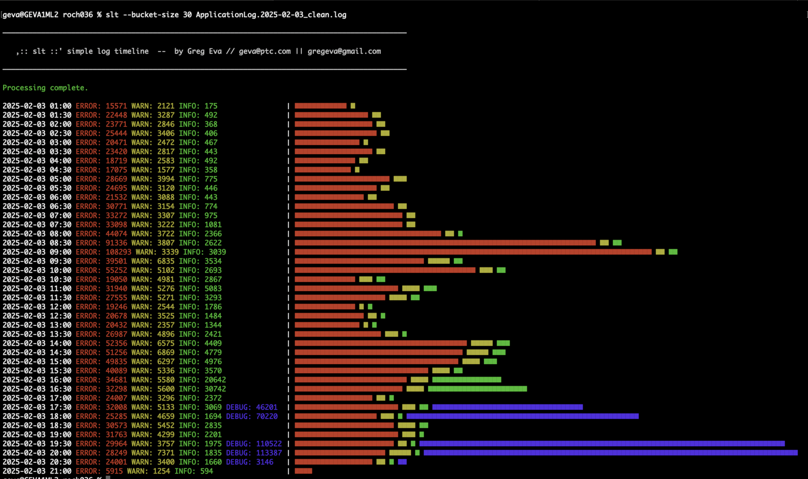
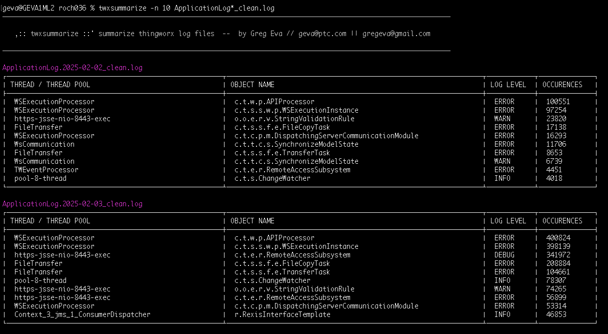

# Tools

These scripts and other resources are built to speed and facilitate debugging, diagnostics, and likely other things.

## llt : Log Time Line

Have you ever wished that you could quickly identify areas of interest or hotspots in very large log files so that you could navigate there directly?  That's what this timeline view is for!!

When dealing with logs which have a very large amount of lines/errors/whatever, it can be quite hard to get an overall view of the file while looking at a screen full of lines representing maybe less than a second.

ltl, or log time line has come a long way since its initial release a few months ago.  The usage principle is basically to a) read log lines and try to establish the included time, b) also pull out message details and stats, c) filter in or out the lines based on provided command line options.  Use it to search for patterns, slowness, determine frequency and spacing of calls, and establish performance profile/baseline of your APIs or services.  See help for a list of all of the options and try them out yourself.

Static binary packages are provided for Windows, Ubuntu, and Mac OS.  Download, rename to ltl, and place somewhere in your path.

## cleanlogs : removes unwanted lines and partial lines to faciliate analysis

Partial lines where one node or thread have written over another log appender make programmatic analysis of logs quite challenging.  Similarly useless things like when there is a multi-line output like a thread dump or nuissance aspects like 100's of thousands of health probes.

Clean logs takes care of some of these scenarios, outputting a "clean" version of one or many log files.

## twxsummarize : ThingWorx Log Summary tool

Similar to the above, this tool is not time-based, but instead groups and summarizes ThingWorx log lines using the common log pattern from Logback.  This helps to answer questions like if certain subsystems are starting to have errors all of a sudden, or if errors present where your diagnostic efforts should focus.

In a future release I'll add other capabilities like a message grouping view.

## Known Issues

- **Millisecond Precision Not Supported:**
  Although the application allows for selection of millisecond precision, reading and comparing timestamps with millisecond precision does not work at present. All timestamp parsing and comparison is currently performed at the second level, so any features or filters relying on millisecond accuracy will not function as expected.

