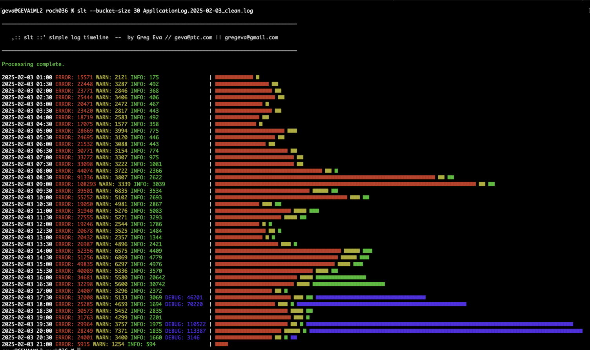
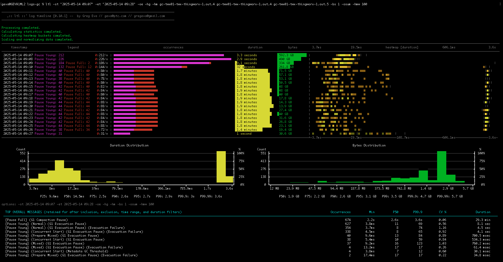

# ltl : Log Time Line

LogTimeLine (`ltl`) is a command-line log analysis tool that turns timestamped log files into visual timelines. Point it at an access log, application log, or GC log and it aggregates millions of lines into time-bucketed bar graphs, color-coded by severity, with per-bucket occurrence counts, latency statistics, and a ranked summary of the top contributing messages — all on a single screen in seconds.

The core of logtimeline's power is ad-hoc filtering. Include patterns to isolate what matters, exclude patterns to remove noise, and highlight patterns to visually compare a subset against the full population — all using regex, refined iteratively as the investigation evolves. This is something metrics systems fundamentally cannot do: you don't need to pre-define what you want to measure. The question is formed during the analysis, sharpened with each run, and changed direction as you learn. Slice, exclude, narrow, then highlight to see your target in the context of everything else.

The timeline is the anchor. Every feature — heatmaps, histograms, session tracking, thread pool activity, user-defined metrics — is a different lens on the same temporal axis. Start with a week of data in 2-hour buckets to spot anomalies, then zoom to millisecond precision over a 5-minute window to understand exact sequences. Switch from duration to byte analysis, examine percentile distributions, check thread pool saturation — each view reveals a different dimension of the same situation.

Unlike log management platforms, logtimeline works directly on files with no infrastructure, no retention limits, and no query timeouts. Download a single binary, point it at a log, and start investigating. It runs the same on a Linux container, a macOS laptop, or a Windows server. The analysis command line is shown on every run, making investigations reproducible and shareable.

For more on the design philosophy and intended workflow, see [Purpose and Design Philosophy](docs/purpose.md).

## Getting Started

1. Go to [Releases](https://github.com/gregeva/logtimeline/releases) and select the latest version
2. Download the binary for your platform and architecture
3. Rename the binary to `ltl` and place it somewhere in your `PATH`
4. On macOS, the binary is not signed — you will need to approve execution under **System Settings > Privacy & Security**

```bash
ltl [options] <logfile> [logfile2 ...]
```

## Documentation

See [docs/usage.md](docs/usage.md) for the full options reference, feature explanations, and examples.

## Screenshots

Here is a very old screenshot showing the tools success in visualizing millions of log lines over a time range in a single screen.



### GC Analysis using Heatmap and Histogram

A Full GC loop explored through zooming in on the specific time range, activating heatmap with 100 character width, enabling duration and bytes histograms, and setting the time-window bucketing to 1 minute.



## Building from Source

### Install Dependencies

```bash
# macOS (uses Homebrew Perl — do NOT use macOS system Perl)
./build/macos-setup.sh

# Ubuntu/Linux
sudo apt-get install build-essential perl perl-base perl-modules libperl-dev cpanminus
cpanm PAR::Packer
cd build && ./generate-cpanfile.sh && cpanm --notest --installdeps .
```

### Build Static Binaries

```bash
./build/macos-package.sh arm64|x86_64    # macOS
./build/ubuntu-package.sh amd64|arm64    # Linux (requires Docker)
./build/windows-package.sh               # Windows (requires Docker + Wine)
```

### Run Directly from Source

```bash
./ltl [options] <logfile>
```
